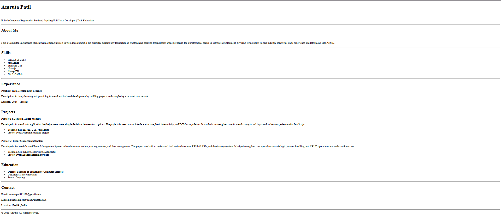

# Single Page Resume Website

## Overview

This project is a single-page resume website built using only HTML.  
The purpose of this assignment is to demonstrate proper HTML structure, semantic elements, and clean layout without using CSS or external libraries.

The resume includes sections such as header, about, skills, experience, projects, education, and contact details.

## Technologies Used

- HTML5

## Usage

This resume template can be used as a base to create a personal portfolio or resume website.  
Users can modify the content inside the HTML file to update personal details, projects, skills, and education information.

To customize:

- Edit text inside HTML tags
- Add new sections using semantic elements
- Replace content with your own details

## How to Run the Project

1. Download or clone the repository.
2. Open the `index.html` file in any modern web browser.
3. The resume will load as a single-page website.

## Live Demo

https://your-username.github.io/repository-name

## Output Screenshots

Screenshots of the resume output are included to demonstrate the final layout and structure of the webpage.

## Author

Amruta  
B.Tech Computer Engineering Student
